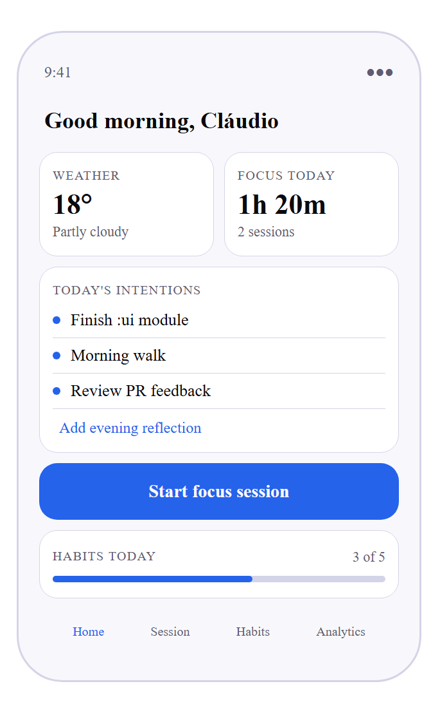
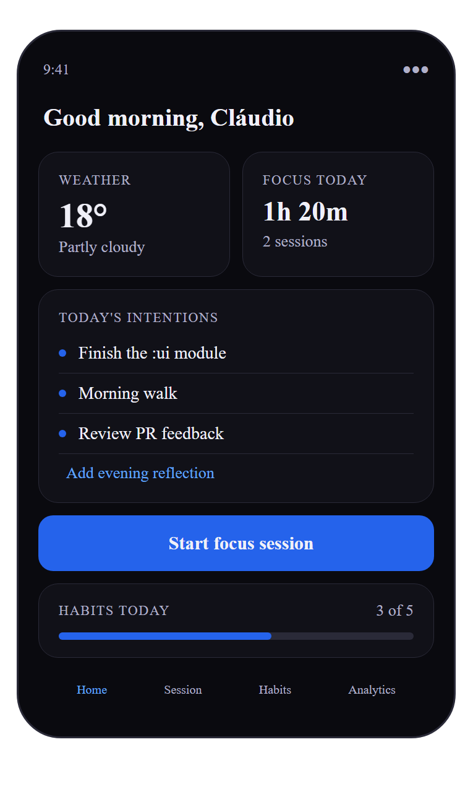

# FlowDay

> Most productivity apps track what you did.  
> FlowDay starts with what you *intend* to do — then helps you follow through.

Mockups of the app screens "can change"

| Home Screen Light Mode | Home Screen Dark Mode |
| :-: | :-: |
|  |  |

---

## What is FlowDay

FlowDay is a local-first Android productivity app built around three daily questions:

- **Morning:** what are my 1–3 priorities today?
- **During the day:** am I actually focusing?
- **Evening:** did I do what I said I would?

Everything stays on your device. Private by design.  
No cloud sync · No social features · No gamification · No AI · No calendar integration

---

## Features

**Focus sessions** — Start a timer when you sit down to do deep work. The timer keeps running even when the app is closed or the phone is locked. Label each session. At the end of the day see exactly how much time you actually focused.

**Daily intention** — Write your 1 to 3 priorities for the day. Not a todo list — intentions. What actually matters today. In the evening do a quick review: did you follow through? One line of reflection closes the loop between what you planned and what you did.

**Habits** — A set of daily habits you want to maintain. One tap to check in each day. Streak tracking and a monthly calendar view show your consistency at a glance. A daily notification reminds you to check in.

**Analytics** — A weekly dashboard showing focus hours per day, habit completion consistency, your best focus day, and your streaks. Drawn natively with Compose Canvas — no third-party chart library.

---

## Screens

FlowDay has four main destinations accessible via the bottom navigation bar (or navigation rail / drawer on larger screens):

**Home** — Today's overview. Shows current weather, today's intentions, a quick start focus session button, and today's habit progress. The screen adapts to what the user has actually done: prompts to set intentions if none exist, and prompts for an evening reflection once intentions are set but reflection is missing. Intention detail and evening reflection are accessed from this screen.

**Session** — Focus timer screen. Shows elapsed time, session label input, start/pause/stop controls, and today's focus summary (total time + session count).

**Habits** — Today's progress bar, habit list with one-tap check-in and streak display, and a monthly calendar showing check-in history. Checked days in blue, partial days in lighter blue, today outlined.

**Analytics** — Weekly dashboard with week navigation. Bar chart of focus hours per day, total focus time and best day summary cards, habit consistency ring, and streak list per habit.

### Navigation

- Phone → `NavigationBar` (bottom)
- Tablet portrait → `NavigationRail` (side)
- Tablet landscape → `NavigationDrawer` (side panel)

Navigation adapts automatically using `WindowSizeClass`.

---

## Architecture

FlowDay follows Clean Architecture with strict unidirectional data flow. Dependencies only point inward — features depend on core modules, never the reverse.

### Module structure

```
FlowDay/
├── app/                  Entry point · MainActivity · NavHost
├── domain/               Pure Kotlin — zero Android dependency
├── database/             Room — entities · DAOs · TypeConverters · Hilt module
├── network/              Retrofit — Weather API · DTOs · caching · Hilt module
├── data/                 Repository implementations · mappers · Hilt bindings
├── ui/                   Design system · shared Compose components
└── feature/
    ├── session/           Focus timer screen
    ├── habits/            Habits screen
    └── analytics/         Analytics dashboard screen
```

### Dependency direction

```
:app → :feature:* → :ui → (nothing)
:app → :feature:* → :domain
:data → :domain
:data → :database
:data → :network
```

`:ui` depends on nothing. Features depend on `:ui` and `:domain`. `:app` wires everything together.

### What `:ui` contains

| Package       | Purpose                                                        |
|---------------|----------------------------------------------------------------|
| `theme/`      | `Color.kt`, `Type.kt`, `Theme.kt` — FlowDay design system     |
| `component/`  | Shared Compose components used across multiple feature screens |

### What `:domain` contains

| Package       | Purpose                                                                              |
|---------------|--------------------------------------------------------------------------------------|
| `model/`      | Pure Kotlin data classes — `FocusSession`, `Habit`, `DailyIntention`, `WeeklyStats` |
| `repository/` | Interfaces — contracts for data access, no implementation                            |
| `usecase/`    | Business rules — one class, one decision, one responsibility                         |

### What `:data` contains

| Package        | Purpose                                                               |
|----------------|-----------------------------------------------------------------------|
| `mapper/`      | Extension functions — entity → domain model conversion                |
| `repository/`  | Implementations of every repository interface defined in `:domain`    |
| `di/`          | Hilt module — binds interfaces to implementations                     |

---

## Design system

**Font** — Inter (static, 4 weights: Regular 400, Medium 500, SemiBold 600, Bold 700)

**Color palette** — Custom FlowDay palette, dark and light. No dynamic color — the app has a deliberate visual identity.

**Theme** — `FlowDayTheme` wraps `MaterialTheme` with the FlowDay color scheme and typography. Applied at the root in `MainActivity`.

**Splash screen** — Uses `androidx.core:core-splashscreen`. Background adapts to device theme — `#F8F8FC` in light mode, `#0A0A0F` in dark mode. Implemented via `values/themes.xml` and `values-night/themes.xml`.

---

## Architecture decisions

**Weather caching** — Weather is fetched once per day and cached in Room using the date as the primary key. Weather serves as context on the Home screen, not a real-time feed. Once per day is sufficient and avoids unnecessary network calls.

**JSON storage for priorities** — `DailyIntention` stores its `priorities` field as a JSON string in Room via a TypeConverter. Acceptable here because priorities are capped at 3 short strings. For larger datasets this would be replaced with a separate relational table.

**3 priority limit** — `SaveIntentionUseCase` enforces a maximum of 3 priorities. This is intentional — the constraint forces the user to decide what actually matters today, rather than dumping everything into a list. FlowDay is not a todo app.

**Database migrations** — The app currently uses `fallbackToDestructiveMigration()` during development. There are no real users and no data worth preserving. Before any public release this will be replaced with explicit `Migration` objects.

**`:data` uses `android.library` not `kotlin.jvm`** — `:domain` is pure Kotlin. `:data` cannot be the same because Hilt requires the Android runtime — any module using Hilt must be an Android library module.

**`:ui` uses `android.library`** — Compose requires the Android runtime, so `:ui` cannot be a pure Kotlin module.

**Shared weather code mapping** — `mapWeatherCodeToCondition(code: Int)` is extracted as a standalone function in `:network`. Both the network mapper and the database cache mapper in `:data` need the same logic — extracting it avoids duplication without creating a new shared module or violating dependency direction.

**Analytics computed entirely in memory** — `AnalyticsRepositoryImpl` fetches all sessions and check-ins and filters them in memory per week. The dataset is local-only and bounded — a user will never accumulate enough data to make this a performance problem. Keeps the DAO layer simple and avoids over-engineering.

**`saveEveningReflection` fetches before upserting** — `IntentionDao` uses `@Upsert`. Saving a reflection for a date that already has priorities would wipe those priorities if the entity were reconstructed from scratch. The method fetches the existing entity first, copies it with the new reflection, and upserts. If no intention exists for that date, the operation is a no-op.

**Adaptive navigation** — The navigation component adapts to screen size using `WindowSizeClass`. Phone uses `NavigationBar`, tablet portrait uses `NavigationRail`, tablet landscape uses `NavigationDrawer`. This lives in `:ui/component/` as a shared component.

**Habits history — monthly calendar** — The habits screen shows a monthly calendar instead of a GitHub-style contribution grid. A grid requires explanation; a calendar is universally understood. Checked days are highlighted in blue, partial days in lighter blue, today is outlined.

---

## Testing

Every use case and repository implementation has unit tests covering all decision paths — success cases, failure cases, and edge cases. Tests run on the JVM with no Android dependency, completing in under 5 seconds.

The CI pipeline runs the full test suite on every push, making it impossible to merge code that breaks existing behaviour.

> This approach doesn't eliminate all bugs — UI and integration issues still require manual testing — but it makes logic bugs in the domain and data layers practically impossible to ship.

**DAO tests** use an in-memory Room database — real SQL queries, isolated state, no emulator required locally. These run locally only, not on CI.

**Repository tests** use MockK — DAOs and API services are mocked, never real implementations. Turbine is used for Flow assertions.

---

## CI/CD

GitHub Actions runs on every push to `feature/claudio/**` and every PR targeting `develop` or `master`.

**What runs on every push:**
- Unit tests — `:domain`, `:network`, `:data`
- Debug build — confirms the full project compiles

**What does NOT run on CI:**  
DAO tests (`:database` module) require an Android emulator. Run locally before pushing.

Workflow file: `.github/workflows/ci.yml`

---

## Project status

| Module               | Status           |
|----------------------|------------------|
| `:domain`            | ✅ Complete       |
| `:database`          | ✅ Complete       |
| `:network`           | ✅ Complete       |
| `:data`              | ✅ Complete       |
| CI (GitHub Actions)  | ✅ Complete       |
| `:ui`                | 🔄 In progress   |
| `:feature:session`   | ⬜ Not started    |
| `:feature:habits`    | ⬜ Not started    |
| `:feature:analytics` | ⬜ Not started    |

---

## Running locally

```bash
git clone https://github.com/ClaudioGarcia98/FlowDay.git
cd FlowDay
./gradlew :domain:test
```

**Requirements:** Android Studio Meerkat · JDK 17 · Android API 26+

---

## Known limitations / future improvements

- `fallbackToDestructiveMigration()` will be replaced with explicit migrations before public release
- Intention slots are capped at 3 per day — v2 will unlock additional slots of 3 when all current intentions are completed, rewarding follow-through

---

## License

MIT
